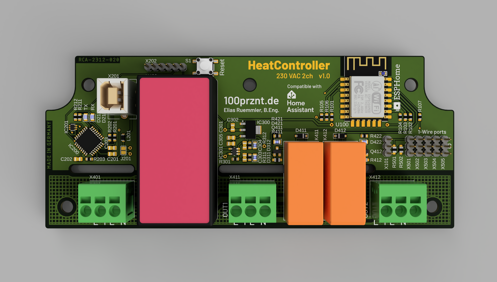
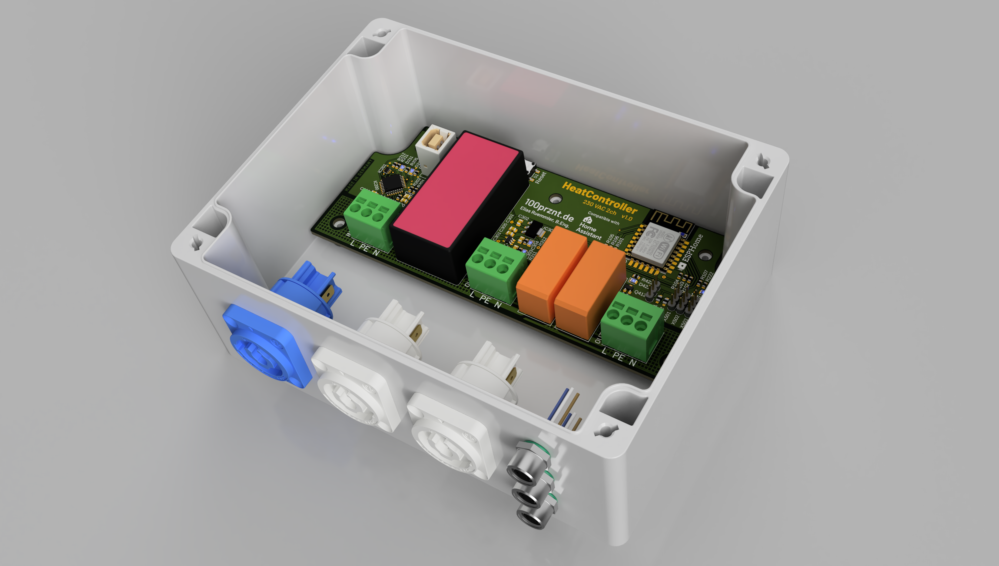

# HeatController
Bang-bang heat controller with 2 channels. ESP8266 based and compatible with Home Assistant.

## Specs
- ESP8266MOD
- Onboard USB-UART bridge (FTDI)
- 230 VAC power supply with higher isolation voltage (for use in wet environment)
- Automatic switching of the power supply between USB and AC power
- Fully compatible with ESPHome and Home Assistant
- 2 output channels (230 VAC max. 10 A)
- 5 header for DS18B20 1-Wire temperature sensors
- header for analog input

## TODOs
- [ ] Add status LED

## Assembly
The PCB fits into a [Spelsberg TG PC 1612-9-to](https://www.spelsberg.de/industrieleergehaeuse/glatt-mit-befestigungsnocken/20100701/) enclosure. There is lots of space for the 230 V wiring in the lower area. I have installed PowerCon sockets from Neutrik here and M8 sockets for the DS818B20 sensors.

