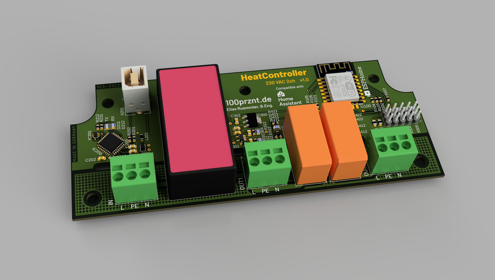

# HeatController
Bang-bang heat controller with 2 channels. ESP8266 based and compatible with Home Assistant.

## Specs
- ESP8266MOD with FTDI USB-UART bridge
- 230 VAC power supply with higher isolation voltage
- Fully compatible with ESPHome
- 2 output channels (230 VAC max. 10 A)
- 5 header for DS18B20 1-Wire temperature sensors
- header for analog input

## TODOs
- [ ] Radien an PCB ergänzen, sehr eng im oberen Bereich
- [ ] Taster für Reset ergänzen
- [ ] Verfügbarkeit USB Buchse prüfen, ggf. USB-C Buchse nutzen
