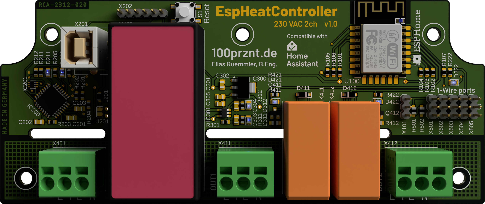
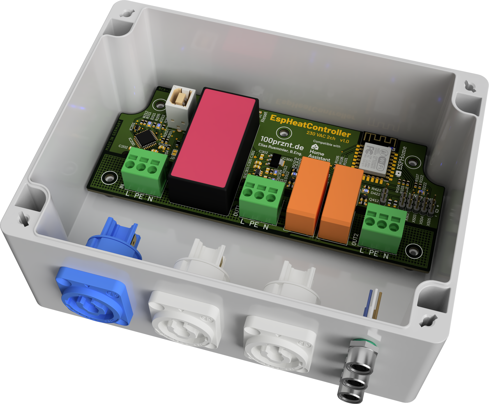
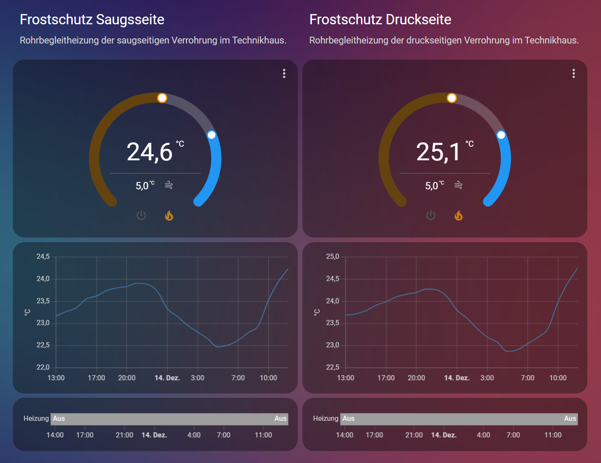
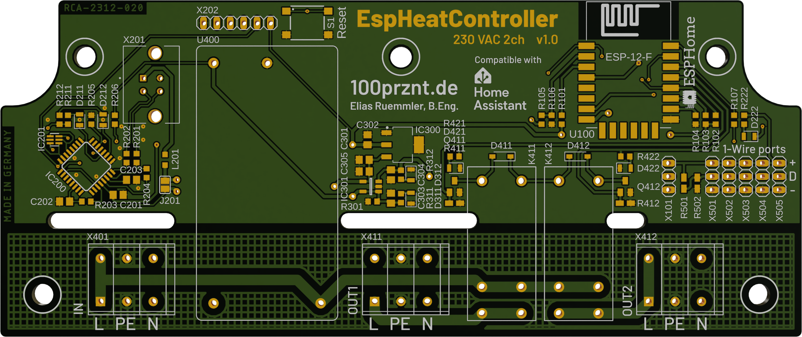

# HeatController
Bang-bang heat controller with 2 channels. ESP8266 based and compatible with Home Assistant.

## Specs
- ESP8266MOD (ESP-12-F)
- Onboard USB-UART bridge (FTDI)
- 230 VAC power supply with higher isolation voltage (for use in wet environment)
- Automatic switching of the power supply between USB and AC power
- Fully compatible with ESPHome and Home Assistant
- 2 output channels (230 VAC max. 10 A)
- 5 header for DS18B20 1-Wire temperature sensors
- Header for analog input

## Assembly
The PCB fits into a [Spelsberg TG PC 1612-9-to](https://www.spelsberg.de/industrieleergehaeuse/glatt-mit-befestigungsnocken/20100701/) enclosure. There is lots of space for the 230 V wiring in the lower area. I have installed PowerCon sockets from Neutrik here and M8 sockets for the DS818B20 sensors.

## Home Assistant

### Dashboard
The initial use of the __EspHeatController__ for me was as a frost watcher in addition to a pipe heating system. I created a separate dashboard in Home Assistant for this use case.

You can find the configuration for this dashboard here:

* [dashboard/lovelace_ehc_config.yaml](dashboard/lovelace_ehc_config.yaml)

The following HACS extensions are required for this dashboard:

* [Mushroom](https://github.com/piitaya/lovelace-mushroom)
* [UI Card for Better Thermostat](https://github.com/KartoffelToby/better-thermostat-ui-card)

## Usage
As mentioned above, I use the __EspHeatController__ as a frost protector, the ESPHome config [esphome_ehc_config.yaml](esphome_ehc_config.yaml) implements a bang-bang controller for this. Alternatively, the hardware can be configured as a thermostat. It is also possible to control a cooling system in addition to the heater using the two switching channels.

## Hardware Versions
See [versions.md](versions.md) for hardware version details.

### New Features
Features for new hardware versions.

* [ ] Onboard temperature sensor
* [ ] X202: Use stadard FTDI header pin assigment
* [ ] Hardware lock between both relays (to use as 2-way motor switch)
* [ ] Hardware lock for the relays in boot state
