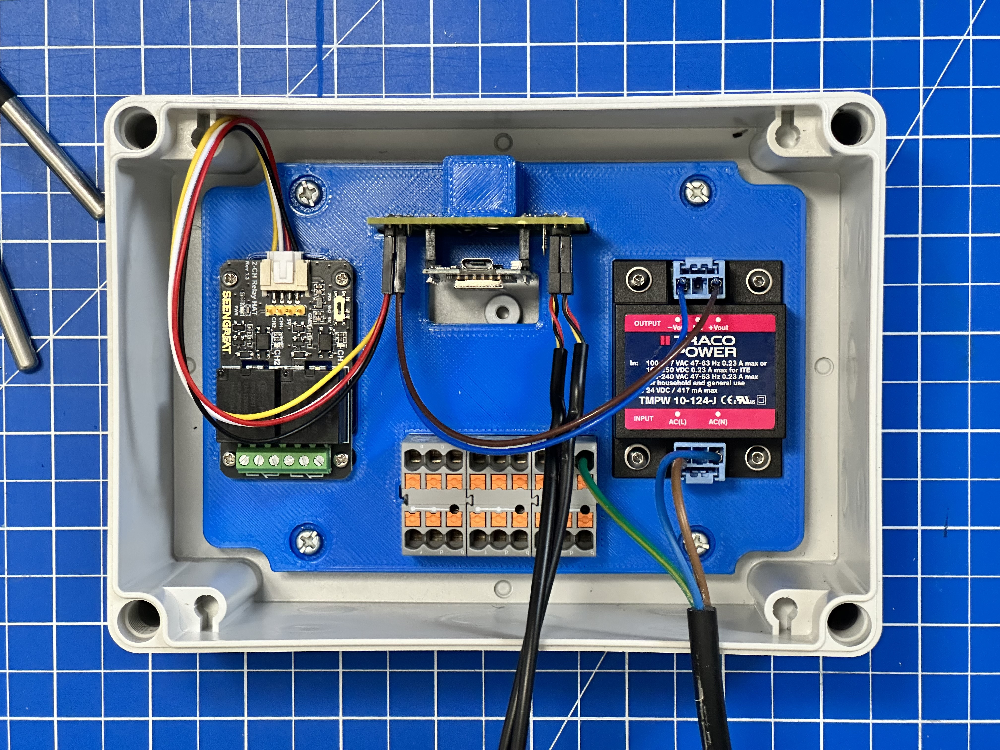

# 1st Prototype

The idea to create the __EspHeatController__ was born out of necessity. Unexpectedly, winter was just around the corner and the pool water pipes were in risk of freezing. So the first __EspHeatController__ was created from the storage box.

# BOM
* [Wemos - D1 mini](https://amzn.to/48l3Jik)
* [XICOOLEE - 2ch Relay Modul](https://amzn.to/3TtgmDJ) 3.3 / 5 V version
* [DS18B20 Sensor](https://amzn.to/48bSDw8)
* [Traco Power - TMP 10-105-J](https://www.tracopower.com/de/deu/model/tmpw-10-105-j)
* [3d printed mounting plate](Einsatz_TK_PC_1813_11_tm.stl)